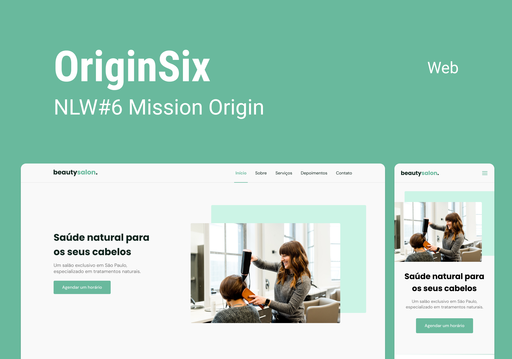

  <a href="#-tecnologias">Tecnologias</a>&nbsp;&nbsp;&nbsp;|&nbsp;&nbsp;&nbsp;
  <a href="#-Projeto">Projeto</a>&nbsp;&nbsp;&nbsp;|&nbsp;&nbsp;&nbsp;
  <a href="#-Layout">Layout</a>&nbsp;&nbsp;&nbsp;|&nbsp;&nbsp;&nbsp;
  <a href="-Desafios">Desafios</a>&nbsp;&nbsp;&nbsp;|&nbsp;&nbsp;&nbsp;
  <a href="#-Licença">Licença</a>

  

 

  

## Tecnologias
Esse projeto foi desenvolvido com as seguintes tecnologias:
- HMTL
- CSS
- JavaScript

Bibliotecas

- [Google Fonts]()
- [SwiperJS](https://swiperjs.com)
- [ScrollRevel](https://scrollrevealjs.org)

Utilitários

- [randomuser.me](https://randomuser.me/photos)
- [IconMoon](https://icomoon.io/app/#/select)
## Projeto
O OriginSix é uma página institucional no formato One Page, responsiva, para usar em diversos tipos de micro, pequena e média empresas. Contém as seguintes seções: Header, Navigation, Home, About, Services, Testimonials, Contact e Footer.
## Layout
Você pode visualizar o layout do projeto através [desse link para o figma](https://www.figma.com/community/file/1009807319507822993/Origin-Six).

OBS: É necessário ter conta no [figma](https://figma.com/) para acessá-lo.
## Desafios
- [ ] Fazer breakpoints no media queries para mais resoluções.
- [ ] Criar uma animação nos cards.
- [ ] Fazer para um modo Dark Mode.
## Licença
Esse projeto está sob a Licensa MIT. Veja o arquivo [LICENSE](./LICENSE)
